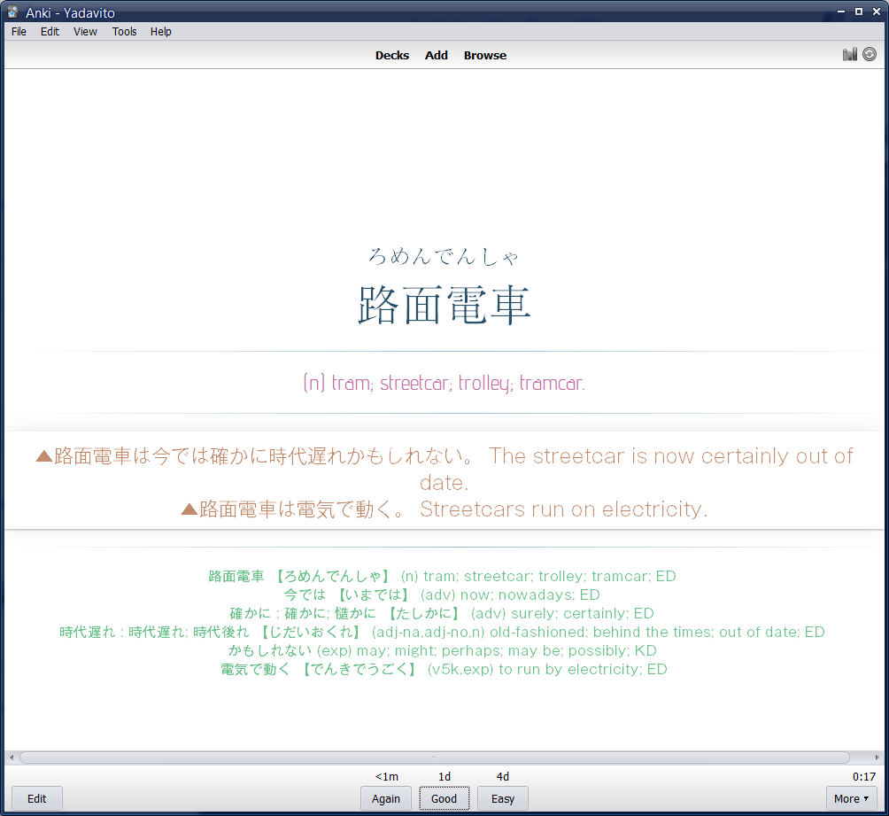
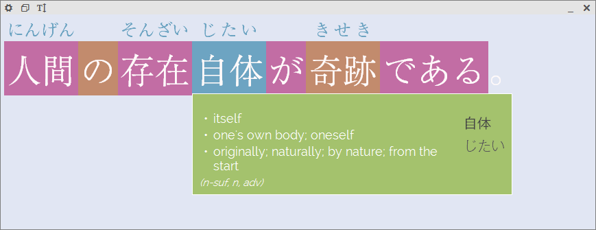

Pretties for Anki, JGlossator and Chiitrans
===========================================

Various css and html snippets for Anki decks, JGlossator and Chiitrans themes. Font are not included.

Screenshots
-----------

Anki example:

Chiitrans example:

JGlossator example:

Fonts
-----

* Advent Pro
* Raleway
* Roboto
* A-OTF リュウミン Pr5
* A-OTF ゴシックMB101 Pro
* IPA P明朝
* IPA明朝

Additional notes
----------------

* JGlossator does not support OTF fonts;
* Both JGlossator and Chiitrans do not support full set of css features;
* Too many fonts, only the few should remain;
* Those should obviously improve productivity, probably, somewhat...

